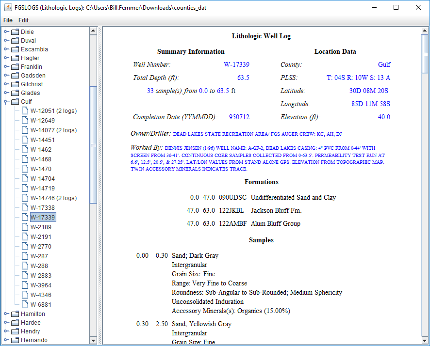
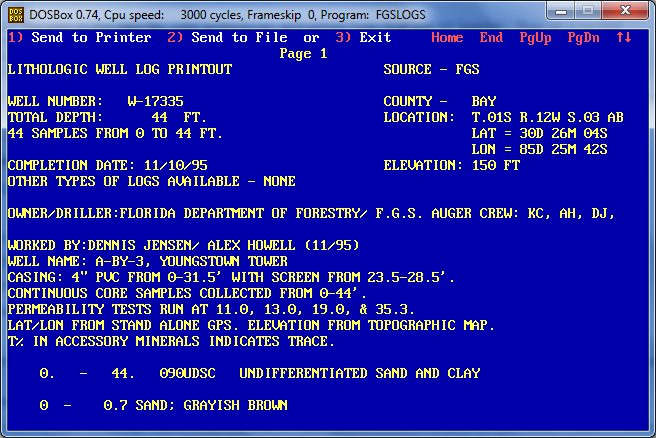

# fgslogs
Java Swing application for opening FGS well data (lithologic) files

*Note: fgslogs is not associated in any way with the Florida Geological Survey or the Florida Department of Environmental Protection (or any other organization, for that matter).*

## Purpose

*fgslogs* is intended to be a replacement for the DOS-based FGSLOGS.EXE program (available from the Florida Department of Environmental Protection at http://www.dep.state.fl.us/geology/gisdatamaps/litholog-temp.htm and shown running in DOSBox in the image below). As noted above, there is no link between this version and the previous DOS-based version. It is coded in java so as to be able to run on most platforms (those supported by a JRE)

## Program Input

The FGS well data is located in multiple ZIP files on an FDEP website (http://publicfiles.dep.state.fl.us/FGS/WEB/lithologic/) and must be downloaded and unzipped in order to be opened by this program. Unlike the original DOS-based FGSLOGS.EXE, which required the unzipped DAT files to be located in a specific directory on the C:\ root directory, the files can exist in any folder on the computer.

## Program Output

In the initial version of this program, the output data will maintain close fidelity with the output of the DOS-based FGSLOGS.EXE program. Future versions of this program will take some liberty and explore better visualization of the data.
